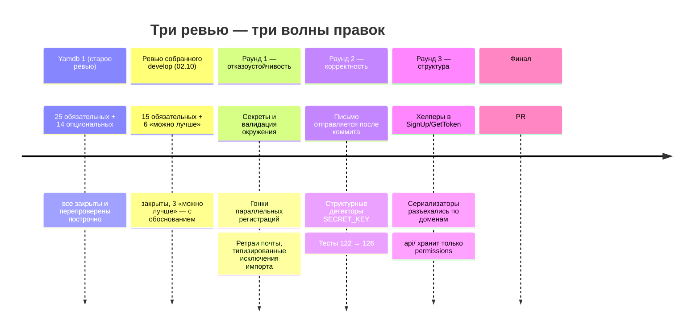
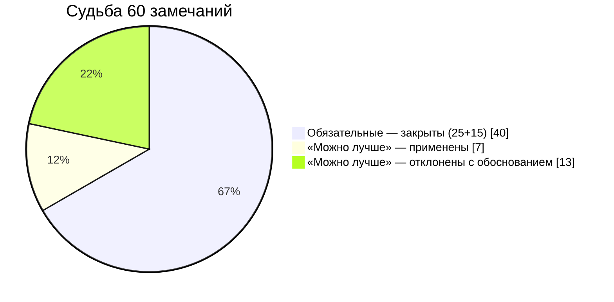
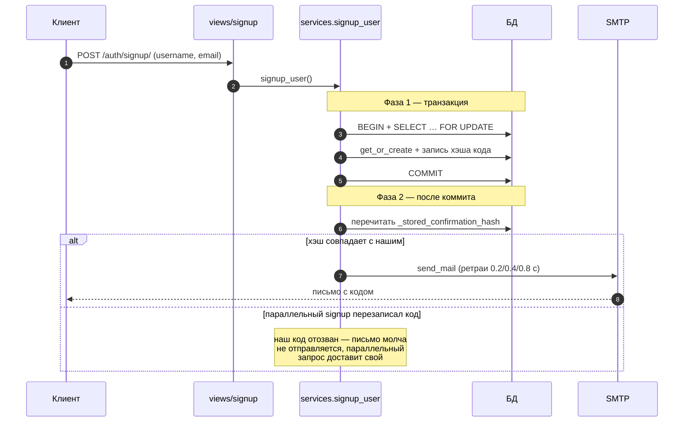
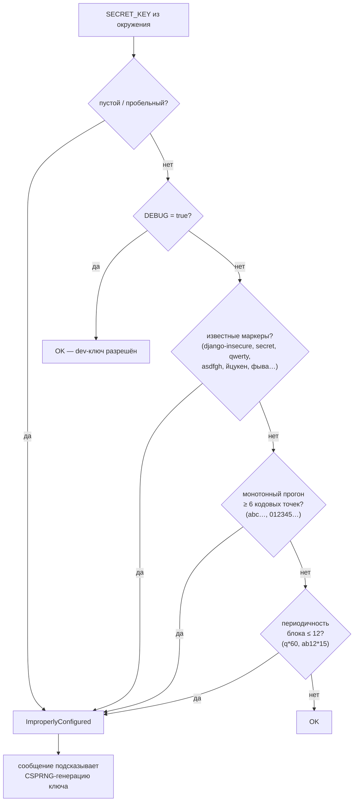
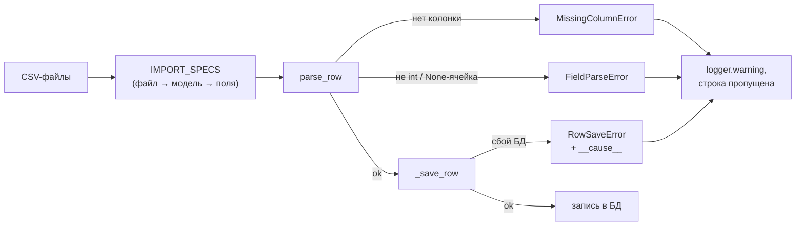
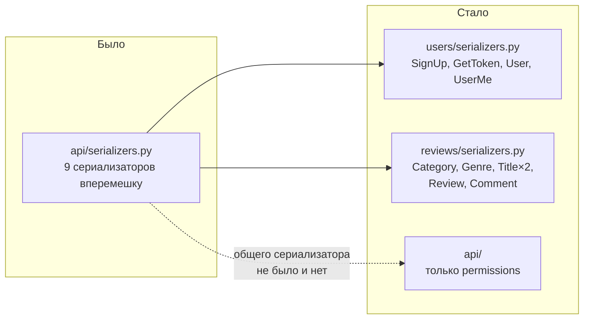
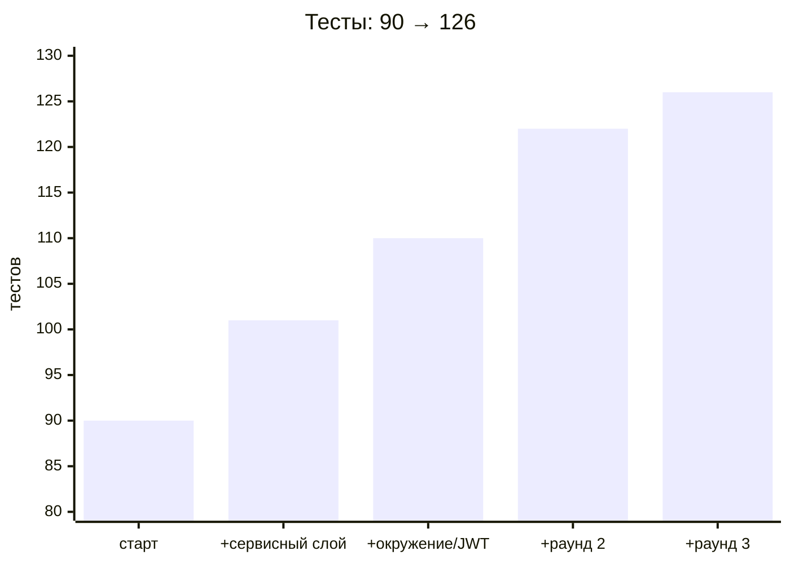

# Ответ на код-ревью — api-yamdb

> **Для ревьюера:** Денис Унтевский. **PR:** [#57](https://github.com/Pavel14701/api-yamdb/pull/57) (`develop` → `main`).
> **Детальная летопись каждой правки:** [REVIEW_FIXES_LOG.md](REVIEW_FIXES_LOG.md) — этот документ лишь карта, лог — источник.

## Итоговый статус

| Проверка | Результат |
|---|---|
| pytest | **126/126** (90 курсовых + 36 юнит-тестов сервиса/настроек/импорта) |
| ruff (B, C4, D/google, E, F, I, N, SIM, UP, W) | 0 замечаний |
| flake8 (вкл. `max-complexity=10`) | 0 замечаний |
| mypy strict (33 файла) | 0 замечаний |
| `makemigrations --check` | OK |
| CodeQL | алерт по воркфлоу найден при подготовке PR — закрыт (`permissions: contents: read`) |

---

## 1. Хронология: от первого ревью до PR

## 2. Что вошло в PR (типология — по автосводке Sourcery)

Сводка — адаптированный текст автосводки Sourcery из тела PR #57 (бот Sourcery; полный ревью не состоялся — исчерпан недельный лимит diff-символов).

- **Новые возможности:** валидация окружения через переменные (`SECRET_KEY`, `DEBUG`, `ALLOWED_HOSTS`, `DEFAULT_FROM_EMAIL`) и явные сроки жизни JWT; сервисный слой `users/services.py` — регистрация, ретраи письма, гонки; доменные сериализаторы/urls/views для users и reviews (маршруты сохранены 1:1); переиспользуемый `TitleQuerySet.with_rating()` и структурный разбор CSV.
- **Исправления:** прод не стартует с небезопасными дефолтами (слабый ключ, `'*'` в хостах, дефолтный отправитель); маршрутизация методов `/users/me/` (405 на PUT); гонки регистрации; доставка отозванных кодов; битые CSV-строки; год произведения в диапазоне поля БД; округление рейтинга.
- **Улучшения:** доменная реорганизация (users/reviews), permissions на свойствах роли; импорт продолжает работу после строчных ошибок; `UserRole(TextChoices)` вместо литералов; изоляция конфигурации админки; сквозная статическая типизация.
- **CI:** джоба `infra` (сервисный слой + настройки/JWT на все события); воркфлоу ограничили `GITHUB_TOKEN` (`contents: read`) — закрытие CodeQL-алерта.
- **Тесты:** 90 → **126** (регистрация, ретраи почты, CSV, рейтинг, окружение, JWT-контракт).
- **Chore:** миграции (год Title, ordering User); удалены устаревшие общие модули сериализаторов/URL.

## 3. Анатомия замечаний

Всего 60 содержательных пунктов по двум ревью (39 старое + 21 новое):

| Файл | Что чинили |
|---|---|
| `users/services.py` (новый) | двухфазный signup, `select_for_update`, ретраи почты, гонки email |
| `settings.py` | секреты из окружения, валидатор `validate_environment()`, детекторы SECRET_KEY, блок `SIMPLE_JWT` |
| `users/serializers.py` (новый) | SignUp/GetToken/User/UserMe; `validate` — диспетчеры + хелперы |
| `reviews/serializers.py` (новый) | контентные сериализаторы, фабрика `_author_username_field()` |
| `api/serializers.py` | **удалён** — расщеплён по доменам |
| `load_csv.py` + `parsing.py` | узкие `try`, `IMPORT_SPECS`, типизированные исключения, толерантность к битым строкам |
| `reviews/models.py` | `SmallIntegerField` + валидатор года, кортежи в constraints, константы длин |
| `users/models.py` | `UserRole(TextChoices)`, `is_admin`/`is_moderator`, `ordering=('username',)` |
| `users/views.py`, `api/views.py` | `@me.mapping.patch` (405 на PUT), точечный `update_fields`, честный 503 при сбое SMTP |
| `.github/workflows/*` | `permissions: contents: read` (CodeQL-алерт) |

## 4. Ключевые правки на диаграммах

### 4.1. Регистрация: код никогда не расходится с БД

Финальная схема (раунд 2 пересмотрел раунд 1: отправка под блокировкой до коммита оставляла получателю «отозванный» код при откате транзакции).

Гонки закрыты на всех уровнях: `get_or_create` разрешает гонку создания по username; конфликт уникального email у разных username — `IntegrityError` → DRF 400 (не 500); код никогда не уходит на чужой адрес. Компромиссы задокументированы в докстринге (микрогонка между перечитыванием и SMTP — миллисекунды; transactional outbox не заводили — непропорционален учебному проекту).

### 4.2. Валидатор SECRET_KEY: детекторы слабых структур

Энтропийные метрики проверены экспериментом и **отклонены**: у ключа-алфавита `abc…`×60 min-entropy ~384 бита, deflate-сжимаемость 1.031 — неотличимо от случайного токена (1.023). Офлайн-проверка одной строки сводится к поиску известных слабых структур:

### 4.3. Импорт CSV: типизированные отказы вместо `except Exception`

Битая строка не останавливает импорт (включая связки жанров); непредвиденное исключение падает громко. Целостность вместо транзакций — идемпотентность `update_or_create`: перезапуск доводит БД до консистентного состояния (проверено повторным импортом — счётчики совпали).

### 4.4. Сериализаторы: монолит расщеплён по доменам

Правило, к которому пришли: сериализатор живёт в приложении своей модели; в `api/` — только по-настоящему общее (permissions). Паттерн `TYPE_CHECKING` + `get_user_model()` (замечание о непрямом импорте модели) сохранён в обоих модулях. `ReviewSerializer.validate` не резался сознательно: проверка там одна — дубликат отзыва.

## 5. Выявлено сверх комментариев ревью

- **20 нарушений «пустая строка после докстринга»** — найдены AST-прогоном по всему проекту; конфликт ruff D202/D204 разрешён осознанно (классы — с пустой строкой, функции — без).
- **`TypeError` от `int(None)`** в `parse_row` — неперехватываемый краш импорта на отсутствующей числовой ячейке (ловили только `ValueError`).
- **Email-гонки** — конфликт уникальности превращался в сырой 500; код мог уйти на чужой адрес.
- **JWT-дефолты**: access-токен жил 5 минут из коробки библиотеки — нигде не был сконфигурирован; теперь 24 ч явно.
- **Ложные срабатывания Pylance** на `IMPORT_SPECS` — Pyright не исполняет mypy-плагин django-stubs; контроль типов только через CLI (`python -m mypy`).
- **CodeQL: воркфлоу без `permissions`** — найдено при подготовке PR #57, закрыто минимальным `contents: read` в обоих воркфлоу.

Рост покрытия по мере находок:

## 6. Осознанные отклонения (аргументированные «нет»)

| Замечание | Решение | Обоснование |
|---|---|---|
| «Уменьшить число точек выхода» в permissions | не применено | ранний `return` для `SAFE_METHODS` — guard clause, которую ревьюер сам хвалит |
| Refresh-токены `/auth/refresh/` | не введены | эндпоинта нет в документации API; контракт ответа `Token` зафиксирован redoc-схемой |
| Transactional outbox | не заводили | отдельная таблица + воркер непропорциональны объёму |
| Продовый SMTP-бэкенд | не введён | учебный проект: письмо печатается в консоль, из него берётся код; зафиксировано осознанно |
| «Откатить `SmallIntegerField` года» | не применено | противоречило обязательному #52; данные CSV 1739–2012 поле покрывает с запасом, нижняя граница добавлена в `validate_year()` |
| Разрезать `ReviewSerializer.validate` | не резали | проверка там ровно одна; хелпер был бы разрезанием ради разрезания |

## 7. Сверка и артефакты

| Ревью | Объём | Результат |
|---|---|---|
| Yamdb 1 (старое) | 25 обязательных + 14 опциональных | **25/25** закрыты; опциональные — применены либо оставлены с обоснованием (построчная сверка: лог §11) |
| Ревью develop (02.10) | 15 обязательных + 6 «можно лучше» | **15/15** закрыты; из 6 «можно лучше» — 3 применены, 3 отклонены с обоснованием в коде (лог §10) |
| Раунды 1–3 (комментарии к фиксам) | 5 комментариев + CodeQL-алерт | все закрыты; алерт закрыт в этом же PR |

Ключевые коммиты: `4411687` (services/parsing, окружение, JWT) → `10e4ae1` (раунд 1) → `fe3a043`, `9a028d9` (раунд 2) → `f6f2a44`, `a537dfe`, `e1ede5c`, `c97a5b4` (раунд 3 — сериализаторы) → `31820f8` (лог §17).

Каждая правка валидировалась полным прогоном: pytest + ruff + flake8 + mypy strict. Полная летопись с мотивацией каждого решения — [REVIEW_FIXES_LOG.md](REVIEW_FIXES_LOG.md).
